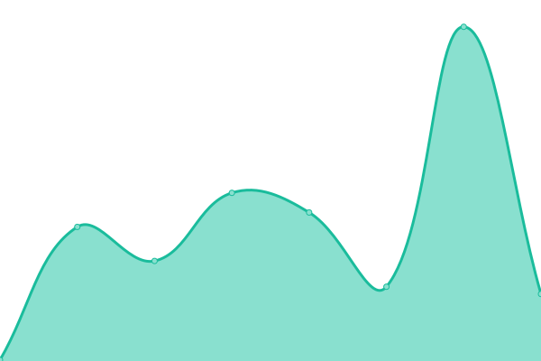

# [📈 实时状态](https://bywhite0.github.io/status): <!--live status--> **系统运行正常。**

This repository contains the open-source uptime monitor and status page for [bywhite0](https://bywhite.wodemo.net), powered by [Upptime](https://github.com/upptime/upptime).

With [Upptime](https://upptime.js.org), you can get your own unlimited and free uptime monitor and status page, powered entirely by a GitHub repository. We use [Issues](https://github.com/bywhite0/status/issues) as incident reports, [Actions](https://github.com/bywhite0/status/actions) as uptime monitors, and [Pages](https://bywhite0.github.io/status) for the status page.

## [📈 Live Status](https://demo.upptime.js.org): <!--live status--> **系统运行正常。**

<!--start: status pages-->
<!-- This summary is generated by Upptime (https://github.com/upptime/upptime) -->
<!-- Do not edit this manually, your changes will be overwritten -->
<!-- prettier-ignore -->
| URL | Status | History | Response Time | Uptime |
| --- | ------ | ------- | ------------- | ------ |
|  [Google](https://www.google.com) | :white_check_mark:正常 | [google.yml](https://github.com/bywhite0/status/commits/HEAD/history/google.yml) | 

 106ms
     
 | 

<a href="https://bywhite0.github.io/status/history/google">100.00%</a>
    

|  [Wikipedia](https://zh.wikipedia.org) | :white_check_mark:正常 | [wikipedia.yml](https://github.com/bywhite0/status/commits/HEAD/history/wikipedia.yml) | 

 535ms
     
 | 

<a href="https://bywhite0.github.io/status/history/wikipedia">100.00%</a>
    

|  [Wodemo主站](https://bywhite.wodemo.net) | :white_check_mark:正常 | [wodemo.yml](https://github.com/bywhite0/status/commits/HEAD/history/wodemo.yml) | 

 287ms
     
 | 

<a href="https://bywhite0.github.io/status/history/wodemo">100.00%</a>
    

|  [GitHub分站](https://bywhite0.github.io) | :white_check_mark:正常 | [git-hub.yml](https://github.com/bywhite0/status/commits/HEAD/history/git-hub.yml) | 

 161ms
     
 | 

<a href="https://bywhite0.github.io/status/history/git-hub">100.00%</a>
    

|  [Vercel镜像站](https://bywhite.vercel.app) | :white_check_mark:正常 | [vercel.yml](https://github.com/bywhite0/status/commits/HEAD/history/vercel.yml) | 

 226ms
     
 | 

<a href="https://bywhite0.github.io/status/history/vercel">100.00%</a>
    

<!--end: status pages-->

[**Visit our status website →**](https://bywhite0.github.io/status)

## 📄 License

- Powered by: [Upptime](https://github.com/upptime/upptime)
- Code: [MIT](./LICENSE) © [bywhite0](https://bywhite.wodemo.net)
- Data in the `./history` directory: [Open Database License](https://opendatacommons.org/licenses/odbl/1-0/)
